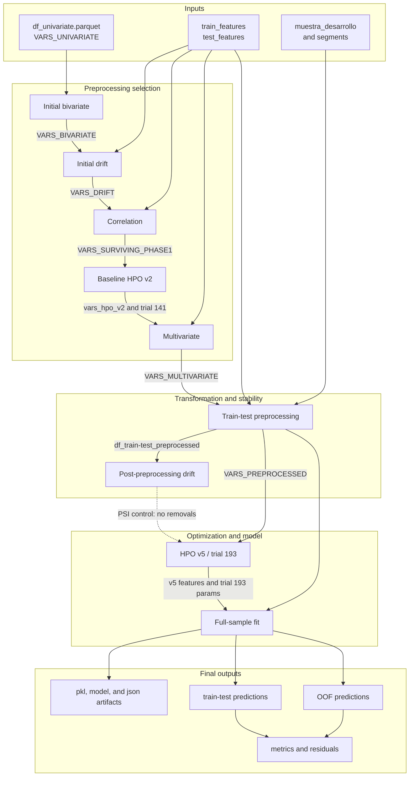

# PF M1 Architecture - `experiments_v2` Modeling Workflow

This document describes the effective Natural Person (PF) M1 modeling sequence under
`notebooks/03_modelos/progreso/pf/m1/experiments_v2/`.

Redesign goal: tune a baseline XGBoost model before multivariate selection, use that
model to guide feature reduction, and improve the final distribution of
`target_progress_score` residuals. The workflow starts from bivariate and drift outputs
created outside `experiments_v2`.

> Static verification based on notebooks and versioned artifacts. No notebooks, Spark,
> Optuna studies, or S3 reads were executed.

## Quick read

- Promoted path: `bivariate` -> initial drift -> correlation -> baseline HPO `v2` ->
  multivariate -> preprocessing -> post-preprocessing drift -> HPO `v5` -> final model
  -> evaluations and residual analysis.
- Multivariate selection: 126 input features -> 12 after Boruta-SHAP -> 11 after
  Stability Selection -> 11 after Backward Selection.
- Preprocessing: 11 features -> 20 features because province is replaced by 10 one-hot
  flags.
- Post-preprocessing drift keeps all 20 features.
- Model explicitly promoted by code: features from `hpo/v5/vars_hpo_v5.py` and
  parameters from `hpo/v5/xgb_optuna_trial193/model_params.txt`.
- Currently evaluated model version: `202606300753`.
- `v6`, `v7`, segmented baseline HPO, and post-preprocessing bivariate analysis are
  experimental or diagnostic branches; they do not feed the current final model.

## Effective execution order

Solid arrows represent the promoted path. Dashed arrows represent validations or
experiments without a downstream consumer in the current model.

```mermaid
flowchart LR
    U["Univariate<br/>shared by M1 and M2"]
    B0["Initial bivariate<br/>316 features"]
    D0["Initial drift<br/>307 features"]
    C["Correlation<br/>307 → 284 → 124"]
    BH["Baseline HPO v1-v2<br/>124 + 2 = 126"]
    BH3["Baseline HPO v3<br/>procedure branches"]
    M["Multivariate<br/>126 → 12 → 11 → 11"]
    P["Train-test preprocessing<br/>11 → 20"]
    PB["Post-preprocessing bivariate<br/>20 → 9"]
    DP["Post-preprocessing drift<br/>20 → 20"]
    H["Final HPO<br/>v1-v7"]
    HX["v6-v7<br/>not promoted"]
    F["Full-sample fit<br/>v5 trial 193"]
    E["Evaluations<br/>train and test"]
    O["OOF prediction<br/>train"]
    R["Residual analysis<br/>bias and dispersion"]

    U --> B0 --> D0 --> C --> BH --> M --> P
    C -.-> BH3
    P -.-> PB
    P --> DP
    P -->|"dataset and vars_preprocessed"| H
    DP -.->|"validates the same 20 features"| H
    H -->|"explicit promotion"| F
    H -.-> HX
    F --> E
    F --> O --> R

    classDef upstream fill:#eef7ff,stroke:#3b82f6,color:#111827
    classDef select fill:#f0fdf4,stroke:#16a34a,color:#111827
    classDef model fill:#fff7ed,stroke:#f97316,color:#111827
    classDef final fill:#fdf2f8,stroke:#db2777,color:#111827
    classDef branch fill:#f8fafc,stroke:#64748b,stroke-dasharray:5 5,color:#111827

    class U,B0,D0 upstream
    class C,M,P,DP select
    class BH,H model
    class F,E,O,R final
    class BH3,PB,HX branch
```

## Main contracts

## Promoted-path contracts

Storage paths are relative to `PATH_PROJECT`.

| Order | Stage | Main inputs | Main outputs | Downstream contract |
| --- | --- | --- | --- | --- |
| 0 | `m1/bivariate/bivariante.ipynb` | `progreso/pf/univariate/df_univariate.parquet`, `VARS_UNIVARIATE`, agency-feature exclusion | S3 `progreso/pf/m1/bivariate/df_bivariate.parquet` and GRMlab results; local `vars_bivariate.py`, `vars_nominales_bivariate.py` | Provides 316 features to initial drift. Upstream of `experiments_v2`. |
| 1 | `m1/drift/after_bivariate/drift.ipynb` | `data/{days}/pf/train_features/`, `VARS_BIVARIATE`, bivariate nominal features | S3 `psi_results_*`, `psi_stats_*`, `psi_plots_*`; local `vars_drift.py`, `vars_drift_removed.py` | Provides 307 stable features to correlation. Upstream of `experiments_v2`. |
| 2 | `base_models/correlation/correlation.ipynb` | `train_features/`, `m1/drift/after_bivariate/vars_drift.py`, bivariate nominal features | S3 `phase1_results.csv`, `phase1_decision_log.csv`; local `vars_surviving_phase0.py`, `vars_surviving_phase1.py`, removal lists, and logs | Removes 23 constants and 160 redundant features through Spearman and Cramér's V. Provides 124 features. |
| 3 | `base_models/hpo/v2/hpo_v2.ipynb` | 124 correlation features plus `mora_antiguedad_dias` and `mora_deuda_principal_mora`; `train_features/` | S3 `study.pkl`, `trials_results.csv`, parameters, and holdout results; local `vars_hpo_v2.py` and per-trial parameters | Multivariate uses the 126 features in `vars_hpo_v2.py` and trial 141 parameters. |
| 4 | `multivariate/multivariate.ipynb` | `vars_hpo_v2.py`, baseline HPO `v2` trial 141 parameters, `train_features/` | S3 phase 2-6 results and CV outputs, `pipeline_summary.csv`; local `vars_surviving_phase3-5.py`, `vars_multivariate.py`, and removal lists | Boruta-SHAP 126 -> 12; Stability 12 -> 11; Backward keeps 11. Provides `VARS_MULTIVARIATE`. |
| 5 | `preprocessing/01_train_test_preprocessing.ipynb` | `train_features/`, `test_features/`, `VARS_MULTIVARIATE`, bivariate nominal features, segments | S3 `preprocessing/df_train_preprocessed/`, `df_test_preprocessed/`, percentile and province-audit outputs; local `vars_preprocessed.py`, `province_group_mapping.py` | Learns thresholds and mapping on train, applies them to test, and provides 20 aligned features. |
| 6 | `drift/after_preprocessing/drift.ipynb` | `df_train_preprocessed/`, `VARS_PREPROCESSED` | S3 `psi_results_*`, `psi_stats_*`, `psi_plots_*`; local `vars_drift.py`, `vars_drift_removed.py` | Post-preprocessing stability control. Current result: 20 kept, 0 removed. |
| 7 | `hpo/v5/hpo_v5.ipynb` | `df_train_preprocessed/`, `VARS_PREPROCESSED`, stratified CV and holdout | S3 `study.pkl`, `trials_results.csv`, parameters, predictions, and holdout metrics; local `vars_hpo_v5.py` and trial parameters | Final model explicitly selects the 20 v5 features and trial 193. |
| 8 | `final_model/01_fit_full_sample.ipynb` | `df_train_preprocessed/`, `df_test_preprocessed/`, `vars_hpo_v5.py`, v5 trial 193 parameters | S3 `fit_full_sample/model_{timestamp}.{pkl,model,json}`, feature importance, train-test predictions; S3 `oof/df_train_pred_oof_{timestamp}` | Produces final artifact, in-sample/test predictions, and OOF predictions for residual diagnostics. |
| 9 | `final_model/02_evals.ipynb` | Train-test predictions for version `202606300753` | S3 `evals/perf_global_*`, `perf_decile_*`, `perf_segment_*`, and PDFs | Evaluates global, decile, and segment performance. |
| 10 | `final_model/03_residuals.ipynb` | OOF predictions for version `202606300753` | S3 `residuals/residuals_global_*`, `residuals_by_segment_*`, t-tests, Levene results, and PDFs; local `residuals_standardization_map.json` | Diagnoses bias and heteroscedasticity globally and by procedure type. |

## Experimental and diagnostic branches

| Branch | Purpose | Status relative to final model |
| --- | --- | --- |
| `base_models/hpo/v1` | First broad baseline search: 1,000 trials and `0.04` gap tolerance. | Replaced by baseline HPO `v2` as multivariate input. |
| `base_models/hpo/v3_solo_hip` | HPO restricted to `HIPOTECARIO`. | No downstream consumer. |
| `base_models/hpo/v3_solo_ejecutivo` | HPO restricted to `EJECUTIVO`. | No downstream consumer. |
| `base_models/hpo/v3_resto` | HPO for every non-`HIPOTECARIO` case; this also includes `EJECUTIVO`. | No downstream consumer; not disjoint from `v3_solo_ejecutivo`. |
| `preprocessing/02_bivariante.ipynb` | Rechecks bivariate predictive power after transformation. Reduces 20 -> 9. | Diagnostic. Its `VARS_BIVARIATE` do not feed drift or final HPO. |
| `hpo/v1-v4` | Iterates trial count, search-space width, and overfitting tolerance. | Historical; not promoted. |
| `hpo/v6` | Expands the v5 search space to 1,000 trials with `0.02` gap tolerance. | Later iteration, but not promoted by `final_model`. |
| `hpo/v7` | Adds parameterized `sample_weight` to emphasize target extremes. | Later and not promoted; its `weight_params.txt` is not read by the current final fit. |

## Final HPO evolution

All versions directly read the 20 features in `preprocessing/vars_preprocessed.py`.

| Version | Trials | Maximum gap | Main change |
| --- | ---: | ---: | --- |
| `v1` | 1,000 | 0.04 | First broad final search. |
| `v2` | 200 | 0.04 | Reduced run with the same base search space. |
| `v3` | 500 | 0.04 | Extends search toward shallower trees and larger `min_child_weight`. |
| `v4` | 500 | 0.04 | Returns to depth 5-9. |
| `v5` | 200 | 0.02 | Tightens overfitting control; promoted version, trial 193. |
| `v6` | 1,000 | 0.02 | Expands the v5 search. |
| `v7` | 1,000 | 0.02 | Adds `w_scale` and `w_power` weights for target extremes. |

## Feature lineage

Counts come from versioned `.py` files:

| Contract | Count | Use |
| --- | ---: | --- |
| `m1/bivariate/vars_bivariate.py` | 316 | Initial drift input. |
| `m1/drift/after_bivariate/vars_drift.py` | 307 | Correlation input. |
| `base_models/correlation/vars_surviving_phase0.py` | 284 | Constants removed. |
| `base_models/correlation/vars_surviving_phase1.py` | 124 | High redundancy removed. |
| `base_models/hpo/v2/vars_hpo_v2.py` | 126 | Previous 124 plus 2 arrears features. |
| `multivariate/vars_surviving_phase3.py` | 12 | Modified Boruta-SHAP result. |
| `multivariate/vars_surviving_phase4.py` | 11 | Stability Selection result. |
| `multivariate/vars_multivariate.py` | 11 | Final result; Backward removes no additional feature. |
| `preprocessing/vars_preprocessed.py` | 20 | Original province replaced by 10 flags. |
| `preprocessing/vars_bivariate.py` | 9 | Diagnostic branch, not promoted. |
| `drift/after_preprocessing/vars_drift.py` | 20 | No PSI removals. |
| `hpo/v5/vars_hpo_v5.py` | 20 | Current final-model features. |

## Relevant preprocessing transformations

- Imputes binary-flag nulls with 0.
- Calculates P01/P99 on train only and reuses those thresholds on test.
- Filters both tails of `mora_deuda_principal_mora` and
  `hermes_firsttit_avg_acc_maintained_12m_amount`.
- Filters only the upper tail of `hermes_firsttit_unpaid_m_90_nc_24m_number` and
  `hermes_firsttit_debt_max_ant_d_12m_number`.
- Learns province groups on train, versions `province_group_mapping.py`, and applies the
  same mapping to test.
- Adds `seg_*` columns for evaluations and residual analysis; they are not part of
  `VARS_PREPROCESSED`.

## Detected mismatches

1. Previous README stated that HPO consumed features surviving post-preprocessing drift.
   This is conceptually true today because drift removes 0 features, but code directly
   loads `VARS_PREPROCESSED`; it does not load
   `drift/after_preprocessing/vars_drift.py`.
2. Post-preprocessing bivariate produces 9 features, but no later stage consumes them.
3. Although `hpo/v6` and `hpo/v7` exist, final fit remains pinned to `v5`, trial 193.
4. `01_fit_full_sample.ipynb` writes the OOF prediction as `pred_m1`, while
   `03_residuals.ipynb` attempts to read `pred`. Current notebooks therefore have a
   schema mismatch unless the historical artifact uses a different schema.
5. `residuals_standardization_map.json` is stored locally and versioned, but the
   residual notebook does not upload it to S3.

## Operational keys

- Target: `target_progress_score`.
- Date: `PJ_procedure_regist_date_month`.
- Join key: `PJ_id`.
- XGBoost objective: `reg:logistic`, with output constrained to `[0, 1]`.
- Typical CV: 4 folds x 8 repeats for HPO/selection; final OOF uses 4-fold
  `StratifiedKFold`.
- Stratification combines registration month, procedure type, and target bins depending
  on the stage.
