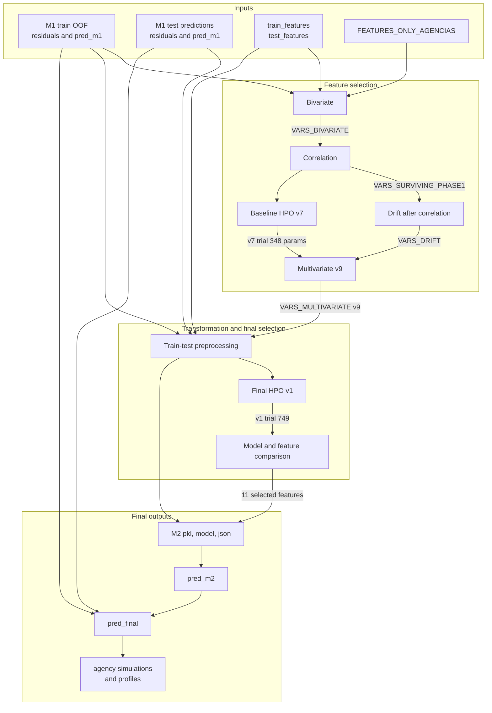

# PF M2 Architecture - `all_features_agencias` Modeling Workflow

This document describes the effective Natural Person (PF) M2 modeling sequence under
`notebooks/03_modelos/progreso/pf/m2/all_features_agencias/`.

M2 is a second-stage model. It does not estimate `target_progress_score` directly.
Instead, it learns the out-of-fold residual left by PF M1, produces `pred_m2`, and builds
the final score as:

```text
pred_final = pred_m1 + pred_m2
```

Agency workload and assignment features are included so the fitted model can also
simulate the expected score under each available external agency.

Upstream architecture: [PF M1 `experiments_v2` workflow](pf-m1-modeling-workflow-experiments_v2.md).

> Static verification based on notebooks and versioned artifacts. No notebooks, Spark,
> Optuna studies, or S3 reads were executed.

## Quick read

- PF M1 version `202606300753` supplies train OOF residuals, test residuals, and
  `pred_m1`.
- Initial candidate set: 124 PF M1 correlation survivors + 27 agency features + 3
  arrears features = 154 features.
- Promoted selection path: 154 -> 20 bivariate -> 18 correlation -> 17 drift ->
  multivariate `v9` with 11 Boruta, 8 Stability, and 5 Backward survivors.
- Baseline parameters promoted into multivariate selection: baseline HPO `v7`, trial
  348.
- Preprocessing one-hot encodes agency and card state. Current
  `VARS_PREPROCESSED` contains 17 columns, including `pred_m1`.
- Final HPO promotion: `hpo/v1`, trial 749, followed by manual feature comparison
  16 -> 13 -> 11.
- Final M2 version evaluated by notebooks: `202607071041`.
- Agency sensitivity analysis simulates every agency for every eligible case and picks
  the agency with the maximum simulated `pred_final`.

## Effective execution order

Solid arrows represent the promoted path. Dashed arrows represent diagnostics,
alternative experiments, or validation gates not read directly by the next stage.

```mermaid
flowchart LR
    M1["PF M1<br/>OOF residuals and pred_m1"]
    RAW["Raw train-test features<br/>including agency features"]
    B["Bivariate<br/>154 → 20"]
    DB["Drift after bivariate<br/>20 → 19"]
    C["Correlation<br/>20 → 18"]
    DC["Drift after correlation<br/>18 → 17"]
    BH["Baseline HPO v7<br/>18 features"]
    BM["Baseline comparison<br/>promotes trial 348"]
    MV["Multivariate v9<br/>17 → 11 → 8 → 5"]
    PP["Train-test preprocessing<br/>5 + 1 → OHE"]
    POST["Post-preprocessing checks<br/>bivariate, correlation, drift"]
    HPO["Final HPO v1<br/>trial 749"]
    CMP["Feature comparison<br/>16 → 13 → 11"]
    FIT["Full-sample fit<br/>M2 version 202607071041"]
    E2["Evaluate pred_m2<br/>vs residuals"]
    EF["Evaluate pred_final<br/>vs target score"]
    SIM["Agency sensitivity<br/>counterfactual simulation"]
    PROF["Profiling and<br/>extra analysis"]

    M1 --> B
    RAW --> B
    B -.-> DB
    B --> C
    C --> DC
    C --> BH --> BM
    DC --> MV
    BM -->|"v7 trial 348 params"| MV
    M1 --> PP
    RAW --> PP
    MV --> PP
    PP -.-> POST
    PP --> HPO --> CMP --> FIT
    M1 --> FIT
    FIT --> E2
    FIT --> EF
    FIT --> SIM --> PROF

    classDef input fill:#eef7ff,stroke:#3b82f6,color:#111827
    classDef select fill:#f0fdf4,stroke:#16a34a,color:#111827
    classDef model fill:#fff7ed,stroke:#f97316,color:#111827
    classDef final fill:#fdf2f8,stroke:#db2777,color:#111827
    classDef branch fill:#f8fafc,stroke:#64748b,stroke-dasharray:5 5,color:#111827

    class M1,RAW input
    class B,C,DC,MV,PP select
    class BH,BM,HPO,CMP model
    class FIT,E2,EF,SIM,PROF final
    class DB,POST branch
```



## Main contracts



## Promoted-path contracts

Storage paths are relative to `PATH_PROJECT`.

| Order | Stage | Main inputs | Main outputs | Downstream contract |
| --- | --- | --- | --- | --- |
| 0 | PF M1 final model | Train `oof/df_train_pred_oof_202606300753`; test `fit_full_sample/df_test_pred_202606300753` | `residuals`, `pred_m1`, `target_progress_score`, identifiers, and segments | Defines M2 target as the residual left by M1. Train uses OOF M1 predictions to avoid target leakage. |
| 1 | `bivariate/bivariante.ipynb` | M1 train OOF residuals; raw `train_features/`; 124 M1 correlation survivors; 27 `FEATURES_ONLY_AGENCIAS`; 3 added arrears features | S3 `bivariate/df_bivariate.parquet`, GRMlab outputs; local `vars_bivariate.py`, `vars_nominales_bivariate.py`, removal lists | Reduces 154 candidates to 20 features. |
| 2 | `correlation/correlation.ipynb` | M1 train OOF residuals, raw train features, 20 `VARS_BIVARIATE` | S3 `phase1_results.csv`, `phase1_decision_log.csv`; local phase-0/phase-1 survivor and removal lists | Removes two redundant features and provides 18 correlation survivors. It reads bivariate directly, not `drift/after_bivariate`. |
| 3 | `drift/after_correlation/drift.ipynb` | M1 train OOF residuals, raw train features, 18 correlation survivors | S3 PSI results, statistics, and plots; local `vars_drift.py`, `vars_drift_removed.py` | Removes `mora_deuda_exigible_vencida`; provides 17 features to multivariate selection. |
| 4 | `experiments/base_models/hpo/v7/hpo_v7.ipynb` | M1 train OOF residuals, raw train features, 18 correlation survivors | S3 Optuna study, trials, parameters, holdout predictions and metrics; local `vars_hpo_v7.py` | Tunes `reg:absoluteerror` over 500 trials with maximum overfitting gap `0.02`. Baseline comparison promotes trial 348. |
| 5 | `experiments/base_models/models_comparison.ipynb` | Default XGBoost, base HPO v7 best parameters, v7 trial 348, 18/17/5-feature alternatives | S3 per-model metrics, predictions, fitted artifacts, metadata, and `model_comparison.csv` | Confirms v7 trial 348 for the 17-feature drift set and for multivariate v9. |
| 6 | `experiments/multivariate/v9/multivariate_v9.ipynb` | 17 post-correlation-drift features, base HPO v7 trial 348 parameters, M1 OOF residual target | S3 phase 2-6 results and CV outputs; local `vars_surviving_phase3-5.py`, `vars_multivariate.py`, removal lists | Boruta-SHAP 17 -> 11; Stability 11 -> 8; Backward 8 -> 5. Provides the promoted multivariate set. |
| 7 | `experiments/preprocessing/01_train_test_preprocessing.ipynb` | M1 OOF train and full-fit test predictions, raw train/test features, 5 multivariate v9 features, added `asignaciones_ult_60_dias_monitorio` | S3 `df_train_preprocessed/`, `df_test_preprocessed/`, category and percentile tables; local `vars_preprocessed.py` | One-hot encodes agency and card state and aligns train/test. Current feature file contains 17 columns, including `pred_m1`. |
| 8 | `experiments/hpo/v1/hpo_v1.ipynb` | Preprocessed train data and preprocessed feature contract | S3 `study.{json,pkl}`, trials, parameters, holdout predictions and metrics; local `vars_hpo_v1.py` | Promotes `reg:absoluteerror` trial 749. Versioned HPO feature artifact contains 16 features. |
| 9 | `experiments/hpo/models_comparison/models_comparison.ipynb` | HPO v1 trial 749, 16-feature HPO artifact, preprocessed train data | S3 model comparison, full/OOF/holdout predictions, fitted artifacts, metrics, and metadata; local three `xgb_hpo_v1_trial749*_features.py` contracts | Compares 16 features, 13 after low-importance removals, and 11 after low-exposure removals. Promotes the 11-feature contract. |
| 10 | `experiments/final_model/01_fit_full_sample.ipynb` | Preprocessed train/test data, 11 selected features, final HPO v1 trial 749 parameters | S3 `fit_full_sample/model_{timestamp}.{pkl,model,json}`, importance, train/test predictions; S3 OOF predictions | Fits M2 on `residuals`, writes `pred_m2`, and creates `pred_final = pred_m1 + pred_m2`. |
| 11A | `experiments/final_model/02_evals.ipynb` | M2 train/test predictions for version `202607071041` | S3 `evals/perf_global_*`, decile and segment outputs, PDFs | Evaluates `pred_m2` against M1 `residuals`. |
| 11B | `experiments/final_model/03_evals_pred_final.ipynb` | Final train/test predictions for version `202607071041` | S3 `evals_pred_final/perf_global_*`, decile and segment outputs, PDFs | Evaluates `pred_final` against `target_progress_score`. |
| 12 | `experiments/analisis/01_sensibilidad_agencias.ipynb` | Final M2 JSON, final predictions, daily agency assignment/stock/no-demand features | S3 `analisis/df_simulacion/`, `df_train_test_simulacion/`, analysis reports | Scores every eligible case under every agency, selects maximum-score agency, and calculates uplift/range diagnostics. |
| 13 | `experiments/analisis/02_profiling.ipynb` and `03_extra_analysis.ipynb` | Final predictions and sensitivity outputs | S3 profiling PDFs and additional analysis outputs | Profiles assignment changes, agency winners, winner margins, and M2 bias by agency and segment. |

## Feature lineage

Counts come from versioned `.py` files:

| Contract | Count | Use |
| --- | ---: | --- |
| PF M1 `base_models/correlation/vars_surviving_phase1.py` | 124 | Non-agency candidate base for M2. |
| `FEATURES_ONLY_AGENCIAS` | 27 | Agency workload, stock, no-demand, and agency identifier features. |
| Added arrears features | 3 | `mora_antiguedad_dias`, `mora_deuda_principal_mora`, `mora_deuda_exigible_vencida`. |
| `bivariate/vars_bivariate.py` | 20 | Correlation input. |
| `correlation/vars_surviving_phase1.py` | 18 | Baseline HPO input and drift input. |
| `drift/after_correlation/vars_drift.py` | 17 | Multivariate v9 input. |
| `experiments/multivariate/v9/vars_surviving_phase3.py` | 11 | Permissive Boruta-SHAP result: features with at least one hit. |
| `experiments/multivariate/v9/vars_surviving_phase4.py` | 8 | Stability Selection result. |
| `experiments/multivariate/v9/vars_multivariate.py` | 5 | Backward Selection result. |
| `experiments/preprocessing/vars_preprocessed.py` | 17 | Current preprocessing contract, including `pred_m1`. |
| `correlation/after_preprocessing/vars_surviving_phase1.py` | 16 | Versioned post-preprocessing correlation result. |
| `drift/after_preprocessing/vars_drift.py` | 16 | Versioned post-preprocessing drift result. |
| `experiments/hpo/v1/vars_hpo_v1.py` | 16 | Versioned final-HPO feature set. |
| `xgb_hpo_v1_trial749_features.py` | 16 | Full trial-749 comparison set. |
| `xgb_hpo_v1_trial749_wo_low_fi_features.py` | 13 | Removes three low-importance card-state flags. |
| `xgb_hpo_v1_trial749_wo_low_fi_low_exp_features.py` | 11 | Removes all five card-state flags; promoted final set. |

## Baseline HPO evolution

| Version | Code input | Objective | Trials | Maximum gap | Status |
| --- | --- | --- | ---: | ---: | --- |
| `v1` | Drift-after-bivariate list | `reg:squarederror` | 1,000 | 0.04 | Historical; versioned feature file no longer matches current input list. |
| `v2` | Drift-after-bivariate list | `reg:absoluteerror` | 500 | 0.02 | Historical; versioned feature file no longer matches current input list. |
| `v3_all_vars` | All 154 pre-bivariate candidates | `reg:squarederror` | 500 | 0.02 | Broad comparison branch. |
| `v4` | 18 correlation survivors | `reg:squarederror` | 300 | 0.02 | Correlation-based branch. |
| `v5` | 18 correlation survivors | `reg:absoluteerror` | 300 | 0.02 | Objective comparison. |
| `v6` | 18 correlation survivors | absolute or squared error | 1,000 | 0.02 | Joint objective search. |
| `v7` | 18 correlation survivors | `reg:absoluteerror` | 500 | 0.02 | Promoted baseline search; trial 348 feeds v9. |

## Multivariate evolution

All versions use 4 folds x 8 repeats, up to 200 Boruta iterations, up to 200 Stability
iterations, and Backward Selection with the 1-SE rule.

| Version | Feature input | Model parameters | Phase counts | Status |
| --- | --- | --- | --- | --- |
| `v1` | Baseline HPO v6 feature list | Standard XGBoost | 4 -> 4 -> 4 | Initial reference. |
| `v2` | Baseline HPO v6 feature list | HPO v6 best | 6 -> 6 -> 6 | HPO-parameter comparison. |
| `v3` | 17 drift-after-correlation features | HPO v6 best | 5 -> 5 -> 5 | Removes drifted debt feature. |
| `v4` | 17 drift features | HPO v7 best | 4 -> 4 -> 4 | Changes baseline parameter family. |
| `v5` | 17 drift features | HPO v7 trial 348 | 4 -> 4 -> 4 | Tests selected baseline trial. |
| `v6` | 17 drift features | HPO v7 best | 11 -> 8 -> 5 | Uses permissive Boruta rule: `hits > 0`. |
| `v7` | 17 drift features | Standard XGBoost | 5 -> 5 -> 5 | Standard-parameter comparison with permissive Boruta. |
| `v8` | 17 drift features | HPO v7 trial 348 | Boruta skipped; 12 -> 5 | Tests Stability/Backward without Boruta filtering. |
| `v9` | 17 drift features | HPO v7 trial 348 | 11 -> 8 -> 5 | Promoted combination. |

## Relevant preprocessing transformations

- Merges PF M1 train OOF predictions with raw train features and PF M1 full-fit test
  predictions with raw test features.
- Adds `asignaciones_ult_60_dias_monitorio` to the five multivariate v9 survivors.
- Fills binary-flag nulls with 0.
- Calculates percentile tables, but current outlier-filtering calls are commented out;
  no P01/P99 case filtering occurs in the active notebook.
- One-hot encodes `agencia` into seven agency flags.
- One-hot encodes `hermes_firsttit_cards_worst_state_cust_type_cat` into five flags,
  including an explicit `nan` category.
- Keeps `pred_m1` in the current preprocessed data contract so final fit can construct
  `pred_final`; the promoted M2 feature list itself does not use `pred_m1`.

## Diagnostic and analysis branches

| Branch | Result | Current role |
| --- | --- | --- |
| `drift/after_bivariate` | 20 -> 19, removes `mora_deuda_exigible_vencida`. | Diagnostic/alternative. Correlation reads the 20 bivariate features directly. |
| `experiments/preprocessing/02_bivariante.ipynb` | Versioned result has 4 survivors; current preprocessing contract has 17 features. | Diagnostic; not consumed by final HPO. |
| `correlation/after_preprocessing` | 16 versioned survivors. | Diagnostic gate; final HPO code does not import it. |
| `drift/after_preprocessing` | 16 versioned survivors, 0 recorded removals. | Diagnostic gate; final HPO code does not import it. |
| `experiments/hpo/v2` | Same search design as v1 but with `reg:squarederror`. | Not promoted. |
| `experiments/analisis/*` | Agency counterfactuals, profiles, winner margins, and bias analysis. | Downstream business analysis after final model fit. |

## Detected mismatches and operational risks

1. `correlation/correlation.ipynb` bypasses `drift/after_bivariate`; the folder order alone
   does not represent the effective dependency graph.
2. Baseline HPO v7 is tuned on 18 correlation survivors, while promoted multivariate v9
   applies trial 348 parameters to the 17-feature post-drift set. This is intentional in
   `models_comparison.ipynb`, but should remain explicit.
3. Current `preprocessing/vars_preprocessed.py` contains 17 features including `pred_m1`.
   Versioned post-preprocessing correlation, drift, and HPO artifacts contain 16 and omit
   `pred_m1`, with no recorded removal in their local removal lists. Rerunning current HPO
   code would load all 17 features and would not reproduce the promoted artifact exactly.
4. Final OOF code writes `perd_final`, while train/test full-fit code writes `pred_final`.
   Consumers expecting a common schema will not find `pred_final` in the OOF artifact.
5. `pred_final` is calculated by addition without clipping. Values outside `[0, 1]` remain
   possible even though the business target is bounded.
6. Training is pinned to PF M1 version `202606300753`; evaluation and analysis are pinned
   to PF M2 version `202607071041`. Changing either requires coordinated path updates.
7. `experiments/multivariate/README.md` documents only v1-v3, while the promoted path uses
   v9. This architecture document reflects notebook dependencies and versioned artifacts.

## Operational keys

- M2 target: `residuals` from PF M1.
- M2 prediction: `pred_m2`.
- Combined prediction: `pred_final = pred_m1 + pred_m2`.
- Original business target: `target_progress_score`.
- Date: `PJ_procedure_regist_date_month`.
- Join key: `PJ_id`.
- Promoted baseline parameters: base HPO `v7`, trial 348.
- Promoted final parameters: final HPO `v1`, trial 749.
- Promoted final feature contract:
  `xgb_hpo_v1_trial749_wo_low_fi_low_exp_features.py` with 11 features.
