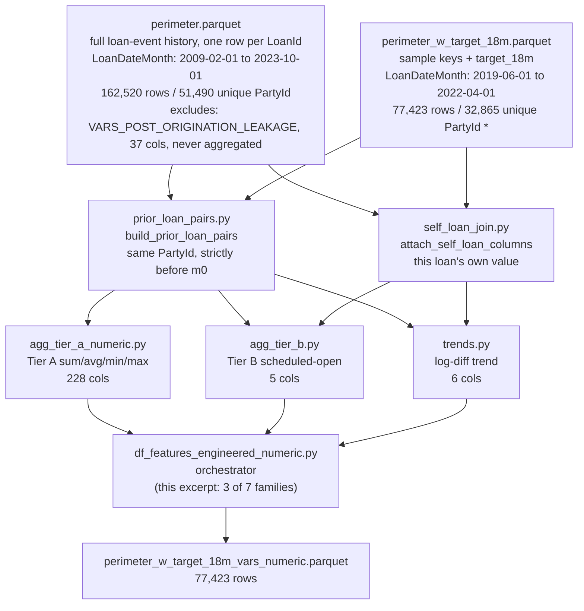

> **Template note (remove this block in a real report):** this is a trimmed excerpt of a real,
> shipped explanation-report. The original covers 7 feature families end to end; this excerpt keeps
> 3 (Tier A, Tier B, Trend) — chosen because they demonstrate 3 different null-policies — purely to
> keep the template's bundled example a reasonable read length. **A real explanation-report covers
> every family/component in the mechanism it documents, never a curated subset.** Read this for the
> *shape and rigor* to copy — the diagram/bullets/glossary pattern, the one core rule, one example
> threaded through every section, hand-computed numbers, the null-policy table, the exclusions list,
> the code map — not as license to leave a real report incomplete. The domain (loan underwriting,
> prior-loan aggregation) is incidental; on an unrelated project ignore the vocabulary.

---

# Feature Engineering — Numeric Features Methodology (excerpt)

> Companion, human-readable walkthrough of how a subset of
> `perimeter_w_target_18m_vars_numeric.parquet`'s engineered columns are built and why. For the
> binding spec, see `docs/memory/plans/PLAN-009-feature-engineering-18m-vars.md`. For the exhaustive
> one-row-per-feature list, see `data/etl/features/features_dictionary_engineered_numeric.csv`.
> Source code lives in `src/etl/features/engineered/`.

## 0. Data flow

- `prior_loan_pairs.py` is the single shared definition of "prior loan" every window-based engine
  consumes — one PIT-safe join, not independently re-derived per engine.
- `self_loan_join.py` is the same idea for "this loan's own value" — used by Tier B's income
  denominator and Trend's `m0` side.
- The final table's row count (77,423) matches `perimeter_w_target_18m.parquet` exactly — the
  engineered build only adds columns, never changes the sample's grain.

**Number provenance** — every figure without a `*` is read directly from this pipeline's own logs
(`reports/perimeter/perimeter.log`, `reports/features/diag_pit_reconciliation.log`). The count marked
**`*`** (unique `PartyId` for `perimeter_w_target_18m`) is not currently logged by any script; it was
computed directly from the already REVIEWER-approved parquet file.

### Glossary

- **`m0`** — the reference month: the `LoanDateMonth` of the loan being scored. Every "prior"
  comparison is relative to this.
- **Prior loan** — any *other* loan the same customer took out strictly before `m0` (a loan opened
  in the same month doesn't count, even same-day).
- **PIT (point-in-time) correctness** — the rule that no feature may use information that wasn't
  knowable as of `m0`. See §1.
- **Tier A / Tier B** — two different "safety tiers" of prior-loan aggregation, treated differently
  because of what's safe to use from a loan that might still be open. See §3.1/§3.2.
- **`w{N}m_lag{K}`** — naming shorthand for "the `N` months ending `K` months before `m0`." See §2.

## 1. The one thing to understand before anything else

Every engineered feature answers a version of the same question: **"looking only at what this
customer had done up to (but not including) the month they took out the loan we're scoring, what do
we know?"** That reference month is called **`m0`**. Nothing in this feature set is allowed to use
information from `m0` or later — that's the entire point-in-time (PIT) correctness discipline this
whole build is organized around.

The raw source is a single point-in-time snapshot (`ReportAsOfEOD` = one value, 2023-10-15, across
the whole file). Any column describing a loan's *servicing* state — balance, days late, write-offs,
`Status`, `DefaultDate` — reflects that loan's state **as of 2023-10-15**, not as of any earlier
month. For a prior loan still open at `m0`, those columns are often non-null *only if* the loan later
defaulted — using them would leak the very outcome we're trying to predict. Because of this, the
entire 37-column `VARS_POST_ORIGINATION_LEAKAGE` bucket is **banned** from every prior-loan
aggregation in this build. Everything below is built only from columns fixed at a loan's own
origination and never revised afterward.

## 2. The naming convention

Every windowed feature name has the shape `{aggregation}_{source_column}_w{N}m_lag{K}`:

- **`w{N}m`** — a window of `N` months.
- **`lag{K}`** — the window ends `K` months before `m0`. `lag0` means the window is the `N` months
  *immediately* before `m0`. Formally, `w{N}m_lag{K}` covers calendar months
  `[m0 − K − N, m0 − K − 1]`, using integer month-index arithmetic
  `m(d) = 12·year(d) + month(d)` (never day-precision offsets).

**This build only ever uses `lag0`** (every window is anchored immediately before `m0`) — so in
practice every name reduces to *"the `{aggregation}` of `{source_column}` across the `N` months
right before this loan's own month."*

## 3. Worked example — one customer, traced through every family

To make every rule concrete, here is one synthetic customer, **María** (`PartyId = P001`). We are
scoring her **Loan 3**, opened in **March 2021** — that is `m0`.
`month_index(2021-03) = 12·2021 + 3 = 24255`.

| Loan | `LoanDate` | `month_index` | `months_before_m0` | `Amount` | `IncomeTotal` | `MonthlyPayment` | `LoanDuration` | `MaturityDate_Original` |
|---|---|---|---|---|---|---|---|---|
| Loan 1 | 2019-03-15 | 24231 | **24** | 1000 | 800 | 90 | 12 | 2020-03-15 |
| Loan 2 | 2020-06-10 | 24246 | **9** | 1500 | 900 | 140 | 18 | 2021-12-10 |
| **Loan 3 (m0)** | 2021-03-20 | 24255 | — (this is m0) | 2000 | 1000 | 180 | 24 | 2023-03-20 |

A loan counts as "prior" only if `months_before_m0 ≥ 1` (`prior_loan_pairs.py`'s rule: same
`PartyId`, strictly before `m0` at month granularity).

---

### 3.1 Tier A — safe-always prior-loan aggregates (`agg_tier_a_numeric.py`)

**Criterion:** aggregate a fixed set of source columns (`Amount`, `IncomeTotal`, `MonthlyPayment`,
…) with `sum`/`avg`/`min`/`max`, over every prior loan whose `months_before_m0 ≤ N`, for
`N ∈ {6, 12, 24}`. Safe for **any** prior loan regardless of its current status — these columns are
fixed at origination and never revised afterward.

**Worked example**, using `Amount` for María at `m0 = 2021-03`:

| Window | Prior loans included | `sum` | `avg` | `min` | `max` |
|---|---|---|---|---|---|
| `w6m_lag0` (`≤ 6`) | *none* (9 and 24 both `> 6`) | **NaN** | **NaN** | **NaN** | **NaN** |
| `w12m_lag0` (`≤ 12`) | Loan 2 (9 ≤ 12) | 1500 | 1500 | 1500 | 1500 |
| `w24m_lag0` (`≤ 24`) | Loan 1 + Loan 2 | 2500 | 1250 | 1000 | 1500 |

`sum_Amount_w6m_lag0` and its siblings are all **`NaN`** for María — **not zero**. A `sum` of zero
prior loans is not the same statement as "this customer's prior loans summed to €0," so it must stay
missing, not become 0 (see §4).

### 3.2 Tier B — scheduled-open-at-`m0` exposure (`agg_tier_b.py`)

**Criterion:** the leakage-safe replacement for "how much is this customer still on the hook for
right now." A prior loan is *scheduled open* at `m0` iff, using only its own origination-time
schedule (never its actual current balance):
`month_index(LoanDate_prior) < m0 ≤ month_index(MaturityDate_Original_prior)`.

**Worked example**, María at `m0 = 2021-03` (`month_index 24255`):

| Loan | `MaturityDate_Original` | `month_index` | `months_remaining = m_maturity − m0 + 1` | Scheduled open? |
|---|---|---|---|---|
| Loan 1 | 2020-03-15 | 24243 | −11 | No — already matured before `m0` |
| Loan 2 | 2021-12-10 | 24264 | 10 | **Yes** |

Only Loan 2 counts. Its `scheduled_residual_principal = Amount × months_remaining / LoanDuration =
1500 × 10 / 18 = 833.33` — a straight-line amortization proxy, never touching Loan 2's *actual*
current balance (a leakage-banned column).

| Feature | Value | Why |
|---|---|---|
| `n_prior_loans_scheduled_open_m0` | **1** | only Loan 2 |
| `sum_scheduled_residual_principal_m0` | **833.33** | computed above |
| `ratio_scheduled_service_to_income_m0` | `safe_divide(140, 1000, eps=1.0)` = **0.14** | `140` = Loan 2's `MonthlyPayment`; `1000` = **Loan 3's own** `IncomeTotal` |

Unlike Tier A, a customer with **zero** scheduled-open prior loans gets `0` / `0.0` here, never
`NaN` — an empty sum is genuinely zero (see §4).

### 3.3 Trend (`trends.py`)

**Criterion:** log-difference features using `log1p` (not a plain ratio) so a value of `€0` doesn't
blow up the calculation: `d_log_{X}_m0_vs_prev = log1p(X at m0) − log1p(X of the single most recent
prior loan)`. Undefined (never `NaN`-as-zero) when there is no prior loan to compare against.

**Worked example**, María, `Amount` (`Amount` at `m0` = Loan 3's own `Amount` = 2000; most recent
prior = Loan 2, `Amount = 1500`):

| Feature | Calculation | Value |
|---|---|---|
| `d_log_Amount_m0_vs_prev` | `log1p(2000) − log1p(1500)` = `7.6014 − 7.3140` | **+0.2874** |

A customer with **zero** prior loans gets `NaN` here — there is nothing to compare `m0` against, and
that absence is not the same statement as "no trend" (see §4).

## 4. Null policy summary

| Family | No-history value | Why |
|---|---|---|
| Tier A (`agg_tier_a_numeric.py`) | **NaN** (including `sum`) | "no data" must never look like "verified zero" |
| Tier B (`agg_tier_b.py`) | **0 / 0.0** | an empty sum is genuinely zero — different mathematical situation from Tier A's avg/min/max, which have no defined value over zero items |
| Trend (`trends.py`) | **NaN** | undefined comparison, not a "no change" |

Three families, three different rules for the same underlying situation ("this customer has no
prior loans") — the exact reason this table exists: getting one of these wrong silently corrupts
every downstream row for first-time customers (≈32% of the modelling sample).

## 5. What's deliberately excluded

- **All 37 `VARS_POST_ORIGINATION_LEAKAGE` columns**, from any prior-loan aggregation — see §1. This
  is the single most important exclusion in this build.
- **A "repaid-and-closed prior loans" behavioral block** was considered — gated on
  `Status == "Repaid" AND ContractEndDate < m0`, which *would* be point-in-time-safe — but rejected
  for a **selection-bias** reason instead: restricting the aggregation population to loans that
  happened to close cleanly makes the feature a function of an outcome correlated with the target.
  See `docs/adr/adr-2026-07-31-defer-closed-prior-loan-aggregates.md` for the full reasoning.

## 6. Where each family lives in code

| Family | Engine | Column-name list |
|---|---|---|
| Tier A | `src/etl/features/engineered/agg_tier_a_numeric.py` | `vars_agg_tier_a_numeric.py` |
| Tier B | `src/etl/features/engineered/agg_tier_b.py` | `vars_agg_tier_b.py` |
| Trend | `src/etl/features/engineered/trends.py` | `vars_trend.py` |
| "Is this loan a prior loan" (shared base) | `src/etl/features/engineered/prior_loan_pairs.py` | — |
| `month_index`/`safe_divide`/`log1p_diff` (shared math) | `src/etl/features/engineered/engineering_helpers.py` | — |

For the exact description of every real feature name (not just this excerpt's 3 families), read
`data/etl/features/features_dictionary_engineered_numeric.csv`.
